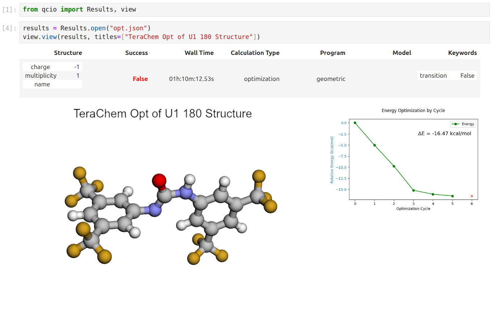
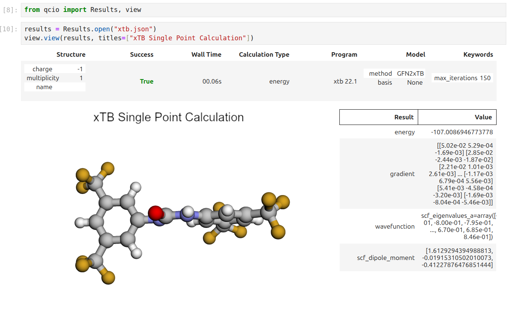

# qccompute

A package for running Quantum Chemistry programs using [qcdata](https://github.com/coltonbh/qcdata) standardized data structures. Compatible with `TeraChem`, `psi4`, `Crest`, `xTB`, `QChem`, `NWChem`, `ORCA`, `Molpro`, `geomeTRIC` and many more.

[](https://pypi.python.org/pypi/qccompute)
[](https://pypi.python.org/pypi/qccompute)
[](https://pypi.python.org/pypi/qccompute)
[](https://github.com/coltonbh/qccompute/actions)
[](https://github.com/coltonbh/qccompute/actions)

`qccompute` works in harmony with a suite of other quantum chemistry tools for fast, structured, and interoperable quantum chemistry.

## The QC Suite of Programs

- [qcconst](https://github.com/coltonbh/qcconst) - Physical constants, conversion factors, and a periodic table with clear source information for every value.
- [qcdata](https://github.com/coltonbh/qcdata) - Beautiful and user-friendly data structures for quantum chemistry, featuring seamless Jupyter Notebook visualizations.
- [qcinf](https://github.com/coltonbh/qcinf) - Cheminformatics algorithms and structure utilities such as `rmsd` and alignment, using standardized [qcdata](https://qcdata.coltonhicks.com/) data structures.
- [qccodec](https://github.com/coltonbh/qccodec) - A library for efficient parsing of quantum chemistry data into structured `qcdata` objects.
- [qccompute](https://github.com/coltonbh/qccompute) - A package for running quantum chemistry programs using `qcdata` standardized data structures. Compatible with `TeraChem`, `psi4`, `QChem`, `NWChem`, `ORCA`, `Molpro`, `geomeTRIC`, and many more, featuring seamless Jupyter Notebook visualizations.
- [BigChem](https://github.com/mtzgroup/bigchem) - A distributed application for running quantum chemistry calculations at scale across clusters of computers or the cloud. Bring multi-node scaling to your favorite quantum chemistry program, featuring seamless Jupyter Notebook visualizations of your data.
- `ChemCloud` - A [web application](https://github.com/mtzgroup/chemcloud-server) and associated [Python client](https://github.com/mtzgroup/chemcloud-client) for exposing a BigChem cluster securely over the internet, featuring seamless Jupyter Notebook visualizations.

## Installation

```sh
python -m pip install qccompute
```

## Quickstart

`qccompute` uses the `qcdata` data structures to drive quantum chemistry programs in a standardized way. This allows for a simple and consistent interface to a wide variety of quantum chemistry programs. See the [qcdata](https://github.com/coltonbh/qcdata) library for documentation on the input and output data structures.

The `compute` function is the main entry point for the library and is used to run a calculation.

```python
from qcdata import Structure, ProgramInput
from qccompute import compute
from qccompute.exceptions import ExternalProgramError

# Create the Structure
h2o = Structure.open("h2o.xyz")

# Define the program input
prog_input = ProgramInput(
    structure=h2o,
    calctype="energy",
    model={"method": "hf", "basis": "sto-3g"},
    keywords={"purify": "no", "restricted": False},
)

# Run the calculation; will return a ProgramOutput or raise an exception
try:
    prog_output = compute("terachem", prog_input, collect_files=True)
except ExternalProgramError as e:
    # External QQ program failed in some way
    prog_output = e.prog_output
    prog_output.input_data # Input data used by the QC program
    prog_output.success # Will be False
    prog_output.data # Any half-computed results before the failure
    prog_output.logs # Logs from the calculation
    prog_output.plogs # Shortcut to print out the logs in human readable format
    prog_output.traceback # Stack trace from the calculation
    prog_output.ptraceback # Shortcut to print out the traceback in human readable format
    raise e
else:
    # Calculation succeeded
    prog_output.input_data # Input data used by the QC program
    prog_output.success # Will be True
    prog_output.data # All structured data and files from the calculation
    prog_output.data.files # Any files returned by the calculation
    prog_output.logs # Logs from the calculation
    prog_output.plogs # Shortcut to print out the logs in human readable format
    prog_output.provenance # Provenance information about the calculation
    prog_output.extras # Any extra information not in the schema

```

One may also call `compute(..., raise_exc=False)` to return a `ProgramOutput` object rather than raising an exception when a calculation fails. This may allow easier handling of failures in some cases.

```python
from qcdata import Structure, ProgramInput
from qccompute import compute
from qccompute.exceptions import ExternalProgramError
# Create the Structure
h2o = Structure.open("h2o.xyz")

# Define the program input
prog_input = ProgramInput(
    structure=h2o,
    calctype="energy",
    model={"method": "hf", "basis": "sto-3g"},
    keywords={"purify": "no", "restricted": False},
)

# Run the calculation; will return a ProgramOutput object
prog_output = compute("terachem", prog_input, collect_files=True, raise_exc=False)
if not prog_output.success:
    # Same as except block above

else:
    # Same as else block above

```

Alternatively, the `compute_args` function can be used to run a calculation with the input data structures passed in as arguments rather than as a single `ProgramInput` object.

```python
from qcdata import Structure
from qccompute import compute_args
# Create the Structure
h2o = Structure.open("h2o.xyz")

# Run the calculation
prog_output = compute_args(
    "terachem",
    h2o,
    calctype="energy",
    model={"method": "hf", "basis": "sto-3g"},
    keywords={"purify": "no", "restricted": False},
    files={...},
    collect_files=True
)
```

The behavior of `compute()` and `compute_args()` can be tuned by passing in keyword arguments like `collect_files` shown above. Arguments can modify which scratch directory location to use, whether to delete or keep the scratch files after a calculation completes, what files to collect from a calculation, whether to stream the program logs in real time as the program executes, and whether to propagate a wavefunction through a series of calculations. Arguments also include hooks for passing in update functions that can be called as a program executes in real time. See the [compute method docstring](https://github.com/coltonbh/src/qccompute/blob/83868df51d241ffae3497981dfc3c72235319c6e/qccompute/adapters/base.py#L57-L123) for more details.

See the [/examples](https://github.com/coltonbh/qccompute/tree/master/examples) directory for more examples.

## ✨ Visualization ✨

Visualize all your results with a single line of code!

First install the visualization module:

```sh
python -m pip install qcdata[view]
```

or if your shell requires `''` around arguments with brackets:

```sh
python -m pip install 'qcdata[view]'
```

Then in a Jupyter notebook import the `qcdata` view module and call `view.view(...)` passing it one or any number of `qcdata` objects you want to visualize, including `Structure` objects or any `ProgramOutput` object. You may also pass arrays of `titles` and/or `subtitles` to add additional information to the molecular structure display. If no titles are passed, `qcdata` will look for `Structure` identifiers such as a name or SMILES to label the `Structure`.


Seamless visualizations for `ProgramOutput` objects make results analysis easy!



Single point calculations display their results in a table.



If you want to use the HTML generated by the viewer to build your own dashboards, use the functions inside `qcdata.view.py` that begin with `generate_` to create HTML you can insert into any dashboard.

## Support

If you have any issues with `qccompute` or would like to request a feature, please open an [issue](https://github.com/coltonbh/qccompute/issues).
